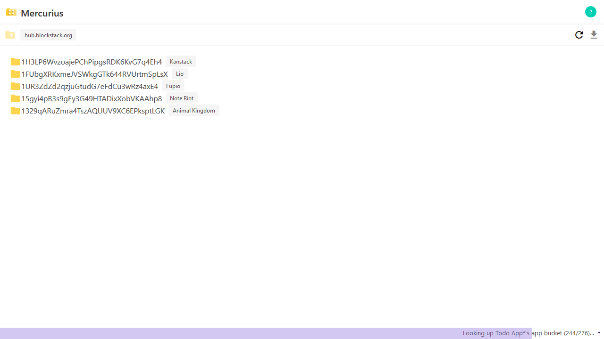

# Mercurius
### *Gaia Hub File Explorer*

Mercurius is a small little file explorer that works by taking
your mnemonic key and looking up many possible app-buckets on
a gaia hub to see if something exists, and if so, then listing
it's contents.

In addition to seeing what apps are storing data, it can also
decrypt any stored data, as well as download data (decrypted)
in bulk via a zip file, all while being completely client-side.

Unfortunately this cannot "autodetect" every folder that you
technically own -- due to the way Gaia works, every bucket
is owned by one address, which is why I have to scrub app
lists and urls in order to generate many possible app buckets,
and then ping the gaia hub to see if anything exists there.

## Limitations

Currently this is limited to your root identity and the
"official" Gaia Hub at `hub.blockstack.org`. You also cannot
upload, move, copy, or delete files, but can only download
and view.

## App Naming Scheme

Currently there are a couple of weird app tags:

- Normal apps (from `app.co/api/apps`) are displayed normally
- Apps from the `blockstack-browser` repo have a `*` next to them
- Apps from your profile.json are shown in url form (without `https://`)
- Apps that I manually added to track have `**` next to them (like XOR Drive)

## Building & Testing

- `npm run build` - build debug, output to `./build`
- `npm run build-prod` - build prod, output to `./build-prod`
- `npm test` - serve `./build` to `0.0.0.0:7171` to test -- this is via
  express's `static()` middleware, but also uses cors
- `npm start` - same as the above, but serve `./build-prod`

## License

Released under [Mozilla Public License 2.0](LICENSE.md), with graphics under
[CC BY-SA 4.0.](https://creativecommons.org/licenses/by-sa/4.0/)
